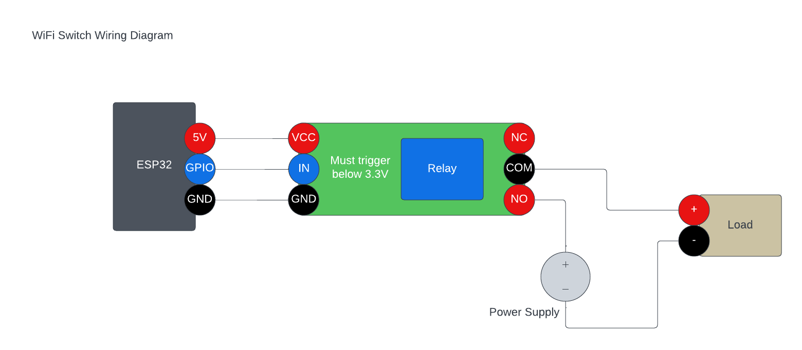

# WiFi Switch

This is an extremely simple firmware for ESP32 microcontrollers which works with a relay module to provide an HTTP-controllable on-off switch for anything in your home or office.

## Prerequisites

* VS Code w/ PlatformIO installed
* Any ESP32 board with one GPIO and 5V broken out
* A relay or relay module which will trigger at 3.3V logic levels
* A power supply suitable for your load
* A load to power

## Wiring

Wire the relay module to the ESP32. Then, connect the power supply to the NO terminal of the relay and the negative terminal of the load. Then, connect the COM terminal of the relay to the positive terminal of the load.

## Flashing

Open up VS Code, then open this project. Edit the WIFI_SSID and WIFI_PSK in main.cpp. Ensure RELAY_PIN is set to the correct GPIO for your wiring. If your relay triggers on a LOW signal, uncomment INVERT_RELAY_TRIGGER. If your GPIO-connected LED is active on a HIGH signal, uncomment INVERT_LED. If your board is available in [this list](https://registry.platformio.org/platforms/platformio/espressif32/boards) then configure it in platformio.ini.

Use the "PlatformIO > Upload" command to compile and upload firmware to a connected ESP32 module.

## Usage

Once the device boots, it will obtain an IP address and start an HTTP server. You can navigate to `http://<esp32-ip>/` in a web browser that is on the same network. Then, use the button to toggle the state of the relay. When the relay is active, you can set a time delay in minutes after which the relay will automatically turn off.

## Troubleshooting

Uncomment `#define SERIAL_DEBUG` in main.cpp and use "Upload and Monitor" in VS Code to troubleshoot issues with WiFi connectivity.
